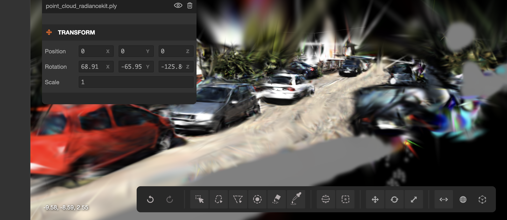

 # KITTI Splat: High-Fidelity Street Reconstruction

This repository contains a 3D Gaussian Splatting (3DGS) pipeline optimized for the sparse KITTI autonomous driving dataset. It uses sensor fusion and semantic AI masking to reconstruct a stable, high-fidelity 3D street scene. An example output can be seen below!



> **Note:** This pipeline is configured specifically to be run end-to-end within Google Colab.

---

## 1. Setup & Installation (Google Drive)

Because this project relies on heavy GPU computation, everything is orchestrated through Google Drive and Google Colab.

1. **Upload the Repository:** Download or clone this repository to your local machine using your terminal:
   ```bash
   git clone https://github.com/deaceda/ec327_kittisplat.git KITTI_Project

and then upload the entire `KITTI_Project` folder to your Google Drive. (Keeping it in the root of your `MyDrive` is necessary).


## 2. Fetching the Data


The project requires the **synced** KITTI dataset (specifically Residential Drive 0064) to properly align the LiDAR, GPS, and Camera data. We have provided an automated notebook to handle this.


1. In Google Colab, open **`src/data/get_kitti_data.ipynb`** by going to File > Open Notebook > GitHub and then enter the KITTI_splat repo link. You should see **`src/data/get_kitti_data.ipynb`**- open it. If you use Google Colab and know how to mount your drive and run the scripts from there, feel free to!

2. Run the cells sequentially. 

3. This notebook will automatically download, extract, and format the synced dataset into the correct directory structure. It will also create an output folder specifically for this dataset. 


## 3. Running the Training Pipeline


Once your data is prepared and masked, you can start the 3D Gaussian Splatting optimizer.


1. In Google Colab, open **`main_notebook.ipynb`** using the same method described above. 

2. Ensure your hardware accelerator is set to GPU (*Runtime > Change runtime type > Hardware accelerator: GPU*). During out runs, we used an L4 and finished training in approximately twenty minuntes. 

3. Run the cells sequentially.


**What the notebook does:**

* Mounts your Google Drive and creates a fast local workspace.

* Installs all dependencies from `requirements.txt`.

* Initializes the custom Densifier with physical safety limits (1.5m scale clamp, 8.0m height ceiling) to prevent geometric artifacts.

* Runs the training loop for 30,000 iterations (providing a live visual preview of the render every 1,000 steps).


**Outputs:** The notebook automatically packages the trained 3D geometry and copies it back to your Google Drive. Look for the `point_cloud_radiancekit.ply` file in your `output/exp_0064/` directory.


## 4. Viewing your 3D Street (SuperSplat)


To interact with your reconstructed street in real-time, we recommend using the PlayCanvas SuperSplat web viewer.


1. Download the **`point_cloud_radiancekit.ply`** file from your Google Drive to your local computer.

2. Open your web browser and go to: [PlayCanvas SuperSplat](https://playcanvas.com/supersplat)

3. Drag and drop your `.ply` file directly into the browser window.

4. Enjoy! Because we are not training off the whole clip (memory issues in Colab), you will see many gray splats. You can easily delete these to have a cleaner splat. 
